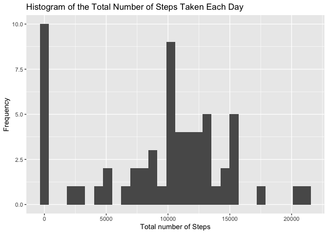
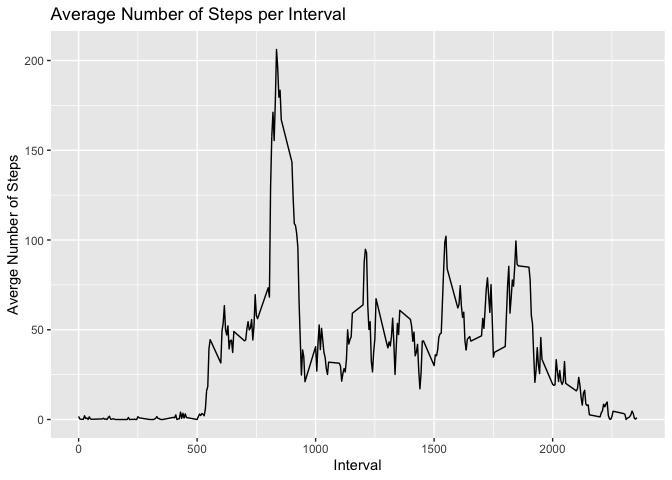
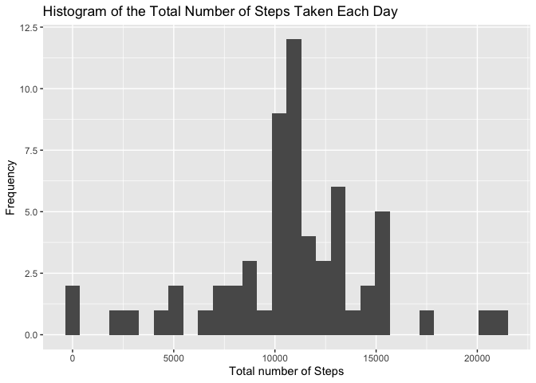
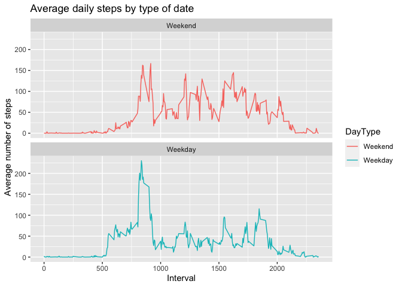

## Loading and preprocessing the data

```r
library(dplyr)
```

```
## 
## Attaching package: 'dplyr'
```

```
## The following objects are masked from 'package:stats':
## 
##     filter, lag
```

```
## The following objects are masked from 'package:base':
## 
##     intersect, setdiff, setequal, union
```

```r
library(ggplot2)
unzip('activity.zip')
activityData <- read.csv('activity.csv')
activityData$date <- as.Date(activityData$date)
```


## What is mean total number of steps taken per day?
1. Total Number of Steps per Day

```r
totalSteps <- activityData %>% group_by(date) %>% summarise(totalSteps = sum(steps, na.rm = TRUE))
```
2. Histogram

```r
ggplot(totalSteps,aes(totalSteps)) + geom_histogram() + labs(title = 'Histogram of the Total Number of Steps Taken Each Day', y='Frequency', x='Total number of Steps')
```

```
## `stat_bin()` using `bins = 30`. Pick better value with `binwidth`.
```

<!-- -->
3a. Mean

```r
mean(totalSteps$totalSteps, na.rm = TRUE)
```

```
## [1] 9354.23
```

3b. Median

```r
median(totalSteps$totalSteps, na.rm = TRUE)
```

```
## [1] 10395
```


## What is the average daily activity pattern?
1. Time Series plot

```r
averageSteps <- activityData %>% group_by(interval) %>% summarise(average = mean(steps, na.rm = TRUE))
ggplot(averageSteps,aes(interval,average)) + geom_line() + labs(title = 'Average Number of Steps per Interval', y='Averge Number of Steps', x='Interval')
```

<!-- -->
2. 5-minute interval with highest average

```r
averageSteps[which.max(averageSteps$average),]
```

```
## # A tibble: 1 x 2
##   interval average
##      <int>   <dbl>
## 1      835    206.
```


## Imputing missing values
1. Number of missing values

```r
sum(is.na(activityData$steps))
```

```
## [1] 2304
```
2.Strategy for filling in all of the missing values in the dataset.

```r
replaceWithMean <- function(x) replace(x, is.na(x), mean(x, na.rm = TRUE))
```

3. Create a new dataset that is equal to the original dataset but with the missing data filled in.

```r
newDataSet <- activityData %>% group_by(interval) %>% mutate(steps = replaceWithMean(steps))
```
4a. Histogram of Total With New Dataset

```r
newTotalSteps <- newDataSet %>% group_by(date) %>% summarise(totalSteps = sum(steps))
ggplot(newTotalSteps,aes(totalSteps)) + geom_histogram() + labs(title = 'Histogram of the Total Number of Steps Taken Each Day', y='Frequency', x='Total number of Steps')
```

```
## `stat_bin()` using `bins = 30`. Pick better value with `binwidth`.
```

<!-- -->
4b. New Mean

```r
mean(newTotalSteps$totalSteps)
```

```
## [1] 10766.19
```

4c. New Median

```r
median(newTotalSteps$totalSteps)
```

```
## [1] 10766.19
```

## Are there differences in activity patterns between weekdays and weekends?
1.  New factor variable in the dataset

```r
newDataSet <- newDataSet %>% mutate(DayType = if_else((weekdays(date) == 'Saturday' | 
  weekdays(date) == 'Sunday'), 'Weekend','Weekday')) %>% mutate(DayType=factor(DayType,levels=c('Weekend','Weekday')))
```
2. Panel Plot

```r
newAverageSteps <- newDataSet %>% group_by(interval,DayType) %>% summarise(average = mean(steps))
```

```
## `summarise()` has grouped output by 'interval'. You can override using the `.groups` argument.
```

```r
ggplot(newAverageSteps, aes(x = interval , y = average, color = DayType)) +
       geom_line() +
       labs(title = "Average daily steps by type of date", x = "Interval", y = "Average number of steps") +
       facet_wrap(~DayType, ncol = 1, nrow=2)
```

<!-- -->

